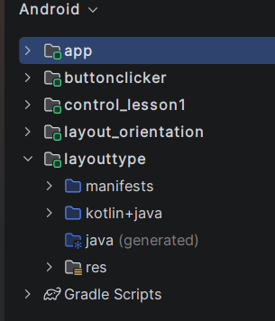
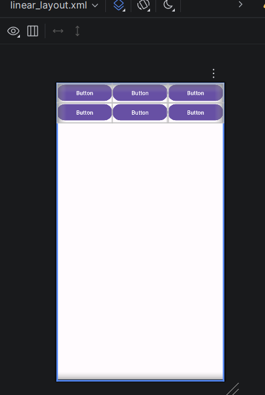
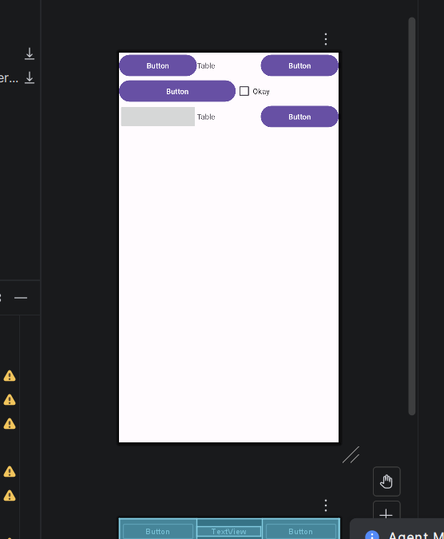
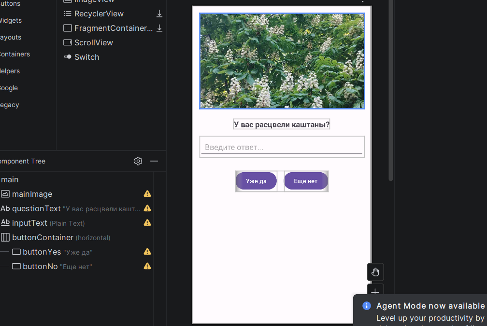
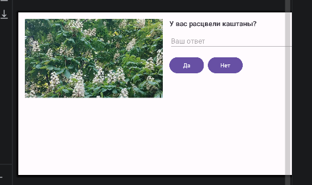
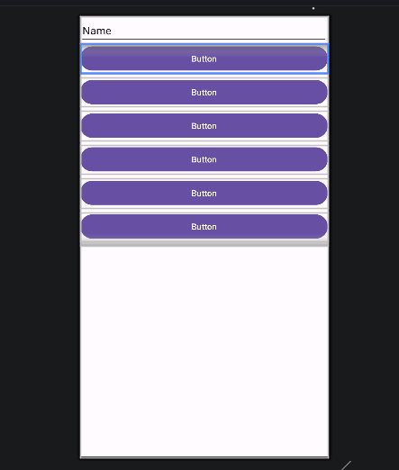
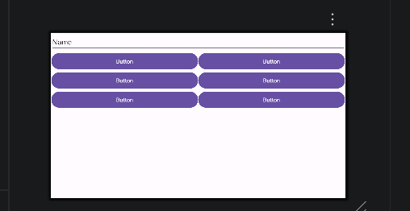
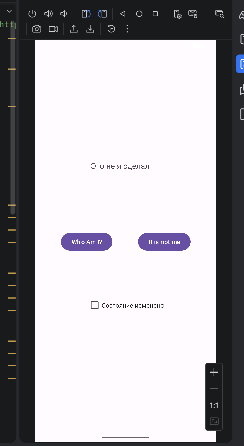
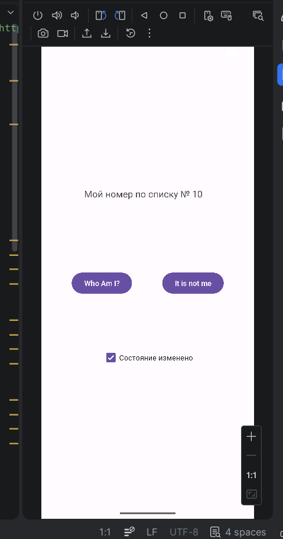

# ОТЧЕТ ПО ПРАКТИКЕ 1

**Дисциплина:** Интеллектуальные мобильные приложения  
**Студент:** Бухтияров Михил Сергеевич  
**Группа:** БСБО-50-24

### Глава 1-2. Настройка среды и создание структуры проекта

Установлена IDE, создан проект ru.mirea.ФамилияИО.lesson1, изучена иерархия и параметры конфигурации.

> 

### Глава 3-4. Проектирование пользовательского интерфейса

Рассмотрены XML-разметка и ключевые атрибуты элементов. Практика с LinearLayout, TableLayout и ConstraintLayout.

> 

> 

> 

> 

### Глава 5. Реализация адаптивной верстки 

Созданы макеты для портретной и альбомной ориентации (layout / layout-land) и проверено переключение при повороте экрана.

> 

> 

### Глава 6-7. Программная обработка событий

Реализован доступ к элементам через findViewById и R. Настроены обработчики кнопок программно и декларативно, изменяются свойства элементов.

> 

> 

### Вывод

Освоены базовые инструменты Android-разработки, структура проекта, адаптивная разметка и обработка событий.
